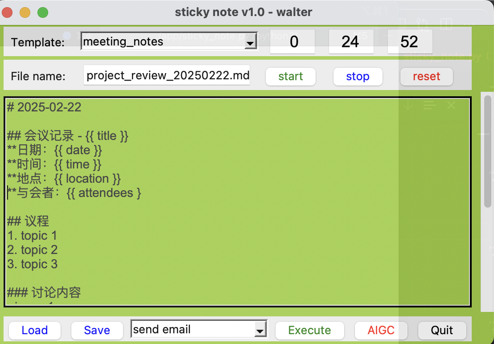

# Daily Sticky Note

My sticky note app for daily work.

## usage

```shell
./app/sticky_note.py [-f <config_file> -t <template_name>]
```


## config
* [sticky_note.yaml](./etc/sticky_note.yaml)
```shell
vi ./etc/sticky_note.yaml
```

* [prompt_template.yaml](./etc/prompt_template.yaml)
```shell
vi ./etc/prompt_template.yaml
```