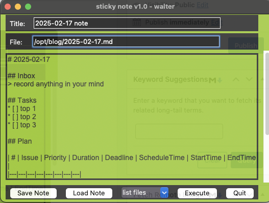

# Daily Sticky Note

My sticky note app for daily work.

## usage

```shell
./sticky_note.py [-f <config_file> -t <template_name>]
```


## config
* [sticky_note.yaml](sticky_note.yaml)
```shell
vi sticky_note.yaml
```